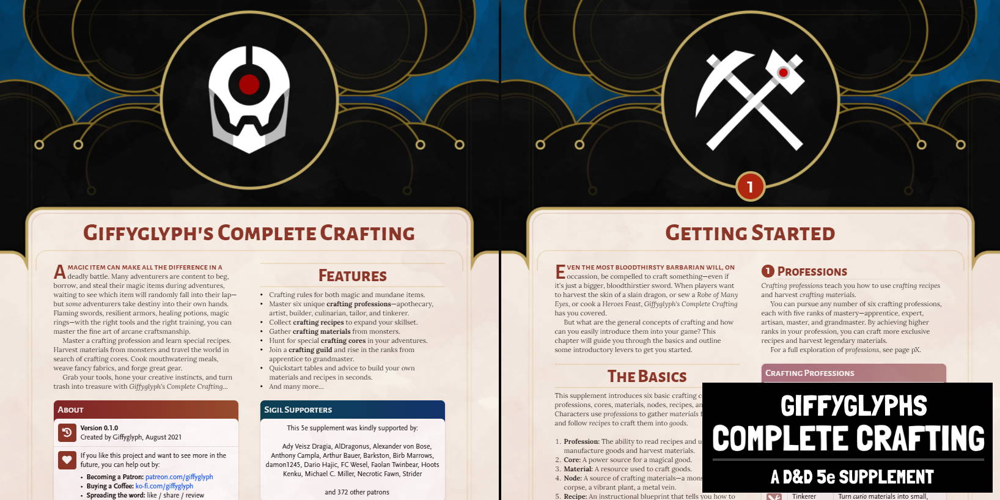

# Changelog

## v1.0.1
* Fixed assorted typos (spotted by Strider).
* Fixed broken table headers for monstrous materials / recipe components.
* Update project to support latest Book Binder restructure.

## v1.0.0
* Added chapters: Getting Started, Profession Feats, Quickstart Materials, and Quickstart Recipes.