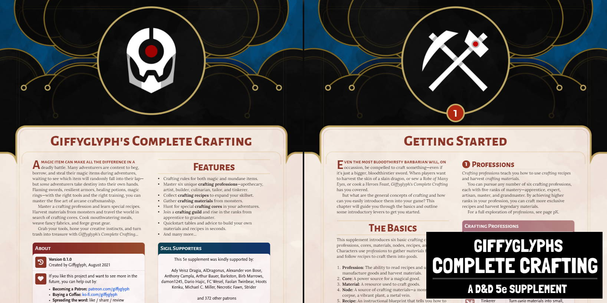

# Giffyglyph's Complete Crafting

Do your D&D 5e players want to forge their own equipment? Want to add some _immersive_ crafting mechanics to your campaigns? Then try **Giffyglyph's Complete Crafting**—a D&D supplement containing modular rules, advice, templates, and sheets compatible with any 5e game. Craft your trash into treasure!

* [Read the Latest PDF (v0.1.0)](https://github.com/giffyglyph/giffyglyphs-complete-crafting/releases/download/v0.1.0/giffyglyphs_complete_crafting_v0_1_0.pdf)
* [Read the Changelog](https://github.com/giffyglyph/giffyglyphs-complete-crafting/blob/master/docs/CHANGELOG.md) 

## Features

* A complete set of **crafting rules** for both magic and mundane items.
* Master six unique **crafting professions**—apothecary, artist, builder, culinarian, tailor, and tinkerer.
* Collect **crafting recipes** to expand your skillset.
* Gather **crafting materials** from monsters.
* Hunt for special **crafting cores** in your adventures.
* Join a **crafting guild** and rise in the ranks from apprentice to grandmaster.
* Quickstart tables and advice to **build your own materials and recipes in seconds**.
* And more.

## Roadmap

To see what's being worked on right now—and what may be planned for the future—check out the **[projects board](https://github.com/giffyglyph/giffyglyphs-complete-crafting/projects)**.

## Bugs and Feature Suggestions

If you notice a bug or have a feature suggestion, visit the **[issue board](https://github.com/giffyglyph/giffyglyphs-complete-crafting/issues)** and open a ticket. Please make sure to be as thorough as possible in your report and attach screenshots where appropriate, as low-effort tickets may be closed out-of-hand.

## Support

If you'd like to see more from this project in future, please consider [becoming a patron](https://www.patreon.com/giffyglyph). You can also find more of my work at:

* [giffyglyph.com](https://giffyglyph.com)
* [twitter](https://twitter.com/giffyglyph)
* [twitch.tv/giffyglyph](https://twitch.tv/giffyglyph)

## Licensing

This work is licensed under a [Creative Commons Attribution-NonCommercial-NoDerivatives 4.0 International License](http://creativecommons.org/licenses/by-nc-nd/4.0/).
